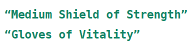
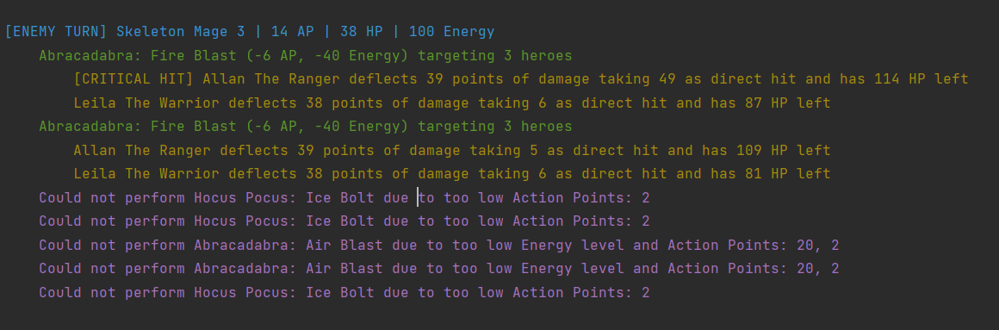
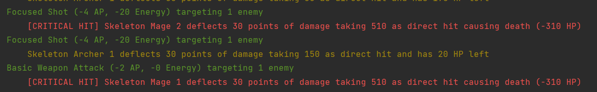
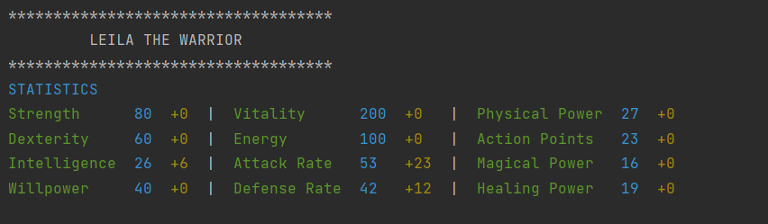

# Final Project

## 1 Environments & Tools
The following IDE and tools have been used during the implementation
for solving the problems in the given Assignment:

* git version 2.37.2.windows.2


* openjdk 19.0.2 2023-01-17


* Apache Maven 3.9.1


* IntelliJ IDEA 2022.3.3 (Ultimate Edition)


* JUnit (for testing purposes)

These environments and tools are used to streamline the process while also preventing possible loss of data with the use of version control.

## 2 Purpose

The purpose of this project is to create a text-based battle game that simulates strategic battles between heroes and enemies. 
The game will involve various characters with unique abilities, equipment, and stats. 
The primary objective is to develop a robust and engaging game system that provides an immersive experience for the players.

The main objectives of the project are as follows:

1. **Character Classes**: Implement base classes for both heroes and enemies, which serve as the foundation for all 
   characters in the game. These classes will define character stats, equipment, abilities, and other relevant functionalities. 

2. **Character Stats and Equipment**: Develop a character stats class that maintains attributes, traits, and combat 
   stats for each character. Implement a character equipment class to represent gear, including weapons and armor, for characters.

3. **Hero Classes**: Create hero classes that inherit from the base character class. Each hero class should have unique 
   abilities and weapon attacks. Heroes should be equipped with suitable gear and abilities during construction.

4. **Enemy Classes**: Implement enemy classes that inherit from the base character class. Each enemy class should have 
   unique abilities and weapon attacks. Enemies should be equipped with suitable gear and abilities during construction.

5. **Action Execution**: Define methods for characters to execute their actions during their turns. The execution 
   should consider the available abilities, resource costs (e.g., action points and energy), and any cost reductions.
   Abilities that can be afforded should be triggered, and damage or healing calculations should be performed accordingly.

6. **Logging and Messaging**: Create a game logger class to manage all logging activity during the game. The logger 
   should allow recording and outputting game information, such as turn details, character statuses, and action results.

7. **Game Mechanics**: Implement game mechanics such as damage mitigation based on defense rate, armor protection, 
   healing, and resource replenishment.

8. **Documentation and Code Quality**: Ensure that the code is well-documented with appropriate comments and follows 
   clean code principles.

By achieving these goals, the project aims to demonstrate proficiency in software engineering concepts, such as 
object-oriented design, design patterns, modular architecture, and unit testing.

## 3 Procedures

In the procedures section, the steps taken to complete project is described. This includes approaches and methods 
used to
solve the problem as well as various complications that emerged during the implementation process and the solutions taken to
eliminate these complications.

### 3.1 Analysing the description

The most important thing to do when working with a big project like this is to get a solid understanding before 
trying to tackle the implementation of the missing classes. It is therefore crucial to study all the information 
given to you, in this case of the project, there are a few things that should be studied. First of all, the project 
came with some pre-defined classes, most important are the classes 
[GameEngine](src/main/java/com/dt180g/project/GameEngine.java) and 
[GameRunner](src/main/java/com/dt180g/project/GameRunner.java). These classes control the game simulation and are 
crucial to study in order to fully understand the intended flow of execution within the program.

The codebase also contains a pre-defined configuration class 
[AppConfig](src/main/java/com/dt180g/project/support/AppConfig.java) which purpose is to provide the program with 
various constants and help-methods to simplify the management and usages of these elements which promotes code 
reusability and consistency.

Another class that eases the management of both GameEngine/GameRunner and 
[CharacterStats](src/main/java/com/dt180g/project/characters/CharacterStats.java) as well as 
[CharacterEquipment](src/main/java/com/dt180g/project/characters/CharacterEquipment.java) is the class 
[IOHelper](src/main/java/com/dt180g/project/support/IOHelper.java). This class provides the game with various 
methods for I/O operations such as IOHelper::formatAsTable and IOHelper::readFromFile.

The class [Randomizer](src/main/java/com/dt180g/project/support/Randomizer.java) is used to randomize various 
numeric values used throughout the game, the class allows for dynamic and varied assignments.

It is also, of course, important to read all the documentations about the program. A pdf describing the intended 
flow and explanation of each class where also provided along with the code base.


### 3.2 Implementation

After reading the documentation about the project, the implementation phase can begin. It is during this phase that 
the implementation of each missing class takes place. As mentioned, it is important to understand the intended 
workflow of the program to be able to implement well-structured classes that adhere to the intended flow of the program.

### 3.2.1 StatsManager

This class is responsible for managing the stats within the game, it provides accessor methods for accessing the 
stats. This class utilizes the AppConfig class to obtain relevant stats and group them together.

The class is implemented as an eager singleton which ensures that only one instance can be created throughout the 
game.

Here is some key functionalities from the StatManager class:

* **Constructor**: The constructor of the StatsManager class is private, this prevents external instantiation of the 
  class. Inside the constructor, the attributeNames, traitNames, and combatStatNames instance field variables are 
  initialized with predefined values obtained from the AppConfig class.
* **Random stat retrieval**: The class utilizes the pre-defined class **Randomizer** to obtain random stat names from 
  the 
  attribute and trait stats. The methods used are `getRandomAttributeName`, `getRandomTraitName`.

  
### 3.2.2 Stats

The game provides three different types of stats, **Attribute**, **Trait** and **CombatStat**. These stats all 
derive from the parent class **BaseStat** which contain methods shared among these stats. Methods such as accessing 
various values or mutator methods for changing values associated with the specific stat.

Each stat have a **name** and a **baseValue**, for example can a specific attribute be named **Strength** and have a 
base value of **80**. The base value for each  stat is constant and should never change. Therefore, to change the 
stat two modifiers are used, **staticModifier** and **dynamicModifier**. The staticModifier is used by the 
characters gears to provide bonuses to the characters stats. The dynamicModifier is used throughout the game and is 
used to handle details regarding HP, AP and energy levels. 

The stats **Trait** and **Attribute** are straight forward and should simply call its parent class **BaseStat** with 
its name and basevalue. However, the **CombatStat** class needs some further explanation. This stat baseValue is 
calculated based on the two other stats, **Trait** and **Attribute**. The stat for trait is always *Attack Rate* 
while the attribute depends on the name of the combatStat. Action Points relies on the attribute Dexterity, Physical 
Power on Strength, Magical Power on Intelligence and Healing Power on Willpower.

To calculate the new base value for the combatStat the Trait and Attributes modified values should be multiplied 
with the constant **COMBAT_STAT_MULTIPLIER** and then return the sum of these rounded to the nearest integer.

### 3.2.3 GearManager

This class acts much like the `StatManager` class, its purpose is to manage all gears(weapons/armors) within the 
game. It provides methods for various ways of retrieving gear based on certain criteria. This class collects each 
armor/weapon by utilizing the `IOHelper::readFromFile` method and pass it a file-name argument. The return value is, 
as can be seen within the method, a list of mapped String keys/values where the key is the type, wield, name, 
restriction 
etc... the value for the `type` key could for example be a String with the value `Shield`.

After retrieving the String information representing the gears, the GearManager constructor instantiate new 
Weapon/Armor objects and adds it into their respective instance field variable `weapons` and `armorpieces`.

The class follows the Singleton design pattern as indicated by the public instance field variable `INSTANCE` and the 
private constructor which prevents instantiation from an outer-source. The singleton design pattern ensures that 
only one instance of the `GearManager` class is present throughout the game, which allows for centralized access to 
the gear information.

By encapsulating the Gear management in a single class promotes reusability and modularization. This seperates the 
gear-related logic from other parts of the code and capsulate them inside this class, making it easier to maintain 
and modify the gear logic overtime.

Some of the methods that this class provide is `getWeaponsOfType`, `getRandomWeapon`, `getRandomArmorOfType` etc, to 
retrieve specific gear based on type and/or restriction class.


### 3.2.4 Gear Hierarchy

The gears (Armor/Weapon) within the program derive from an abstract class `BaseGear`. This parent class implements 
some core functionality that each gear share, such as `type` (e.g. Axe or Chest), the name of the gear (e.g. Broad 
Sword or Gauntlets) and class `restriction`. As an example lets take the **Broad Sword** as an example. This Weapon 
object might have the restriction that it can only be equipped by `Warrior` heroes. This means that a hero of the
wrong type, lets pick `Cleric` can not equip this weapon into his empty weapon slot. This functionality must work in 
order to give out the correct weapons/armors to the right class restriction. 

That is why the `BaseGear` class provides methods such as `getClassRestrictions` which retrieves the class 
restrictions for a specific gear, and `checkClassRestriction` which is used to check if the gear restriction match 
the `Class<?> classRestriction` parameter within the method. The checkClassRestriction can call the 
getClassRestrictions and compare them to the classRestriction parameter, if there is a match, the method returns 
true and the gear can be equipped if there is slots left.

The overridden `toString` method within the BaseGear class simply returns the name of the gear, this method will be 
used by derivatives to retrieve gear name.

Even though the derivatives share some core functionality, they differ in some of their characteristics and should 
therefore be inherited from the superclass `BaseGear` and implement their own unique functionalities.

There is one important thing to note within this class, it is the abstract method `getStat` which returns the stat 
linked to a specified gear. This method is abstract and will be implemented within the derivative classes since they 
do **not** share the same stat, weapons grant bonuses to a random **attribute**, while armors grant bonuses to a random 
**trait**.

**Armor**

The Armor class is one of the gear types in the game, it holds instance field values such as `protection`, 
`material` and a random `Trait` object linked to each Armor objects. It provides unique accessor methods such as 
`getProtection`, `getMaterial`. The abstract method `getStat` also gets implemented and simply returns the `Trait` stat.


**Weapon**

The Weapon class also have unique characteristics, its instance field variables differs from the Armor class, it 
stores information about a specific weapons `damage`, `wield`, and a random `Attribute` linked to its Weapon object. 
Similarly to the Armor class, the Weapon provides accessor methods such as `getWield`, `getDamage` and a method 
`isTwoHanded` which checks if the specified weapon is two-handed or not.

Both the derivatives overrides the parent class `toString` and provide their unique values to it. It retrieves the 
name of the Gear (using `super.toString()`), adds "Of" after it and then retrieves the name of the specific stat 
linked to the gear. The gear retrieve the `BaseStat::getStatName()`. An example of the output would look like this:




### 3.2.5 Abilities

Each character gets specific abilities given to them during construction, the abilities are essential for the 
program to work as intended. Without abilities the characters would not be able to perform attacks at all. 

Much like the Gears, the abilities share some common functionalities and therefore use an abstract base component 
`BaseAbility`.
All abilities can be executed and all the 
abilities cost a certain amount Energy and ActionPoints. However, this time there are four abstract methods that all 
have different characteristics within each of the derived abilities. The methods are `isMagic`, `isHeal`, 
`getAmountOfTargets` and the `execute` method used to execute each of the abilities, will call the 
protected `performAbility` method.

As mentioned, the base component specifies a protected method used when the derivatives should execute their 
abilities.

The constructor to the base component accepts two arguments this is the amount of energy cost and action point cost 
the ability needs. The instance fields are initialized with the provided arguments.

**abilities**

The abilities may or may not require an arugment to its constructor, it depends on if the ability is `magical` or 
not. If the ability is magical the magicphrase needs to be passed as the argument and is stored within the instance 
variable named `magicalPhrase`. When the ability is being constructed, it calls the superclass (BaseAbility) with 
the needed information (energy cost and AP cost).

This is where all the abstract methods gets implemented, most of which are straightforward. However, the `execute` 
method needs further explanation. Whenever the ability should be executed, it will call the protected method 
`performAbility` inside the parent class with relevant information, such as amount of targets and base attack.


### 3.2.6 BaseCharacter

In the `BaseCharacter` class all shared functionality among heroes/enemies is performed. It acts like the base 
component to all characters in the game. It stores information about a specific characters stats, equipment and 
their respective abilities. The class constructor accepts the characters stats as argument and instantiate new 
`CharacterEquipment` and an array that is planned to hold the characters abilities.

The class provides four protected methods(including constructor), these are `addAbilities`, `getTurnInformation` and 
`executeActions`. The `addAbilities` method is self-explanatory, it adds all the abilities given as argument to the 
instance field variable `abilities`.

`getTurnInformation` is used to log information about the characters name, as well as their AP, HP and Energy by the 
use of the `ActivityLogger` class. The String argument is to determine whether the character is an enemy or hero.

The `executeActions` method is used to perform each ability inside the arraydeque (obtained via `determineActions`) 
and withdraw their respective Action Points and Energy cost from the characters current AP/Energy levels. If the 
character can not afford to perform a specific ability, it is simply skipped.

### 3.2.7 Character Stats

The `CharacterStats` class contains each character's stats. In its constructor the stats base value are calculated 
and will later be adjusted using one of the mutator methods provided inside the class. The class provides various 
accessor and mutator methods to change and access various elements inside the stats.

The overridden `toString` method formats the characters stat in a table-form manner and is used by the 
`BaseCharacter` to display whenever a user wants to view a characters' statistics/gear. The method utilizes the 
`IOHelper::formatAsTable` to get the correct format.

### 3.2.8 Character Equipment

This class stores the characters gears (weapons and armorpieces), since it does not specify a custom constructor it 
uses the default constructor that the java compiler gives to it. The class have methods to access and mutate the 
instance field variables which contains the weapons and armor pieces linked to the character. Some of its accessor 
methods are used to get the total weapon damage and total armor protection, this method uses Stream API to map each 
armor/weapon protection/damage integer and sums all of them at the end.

This class is also used to check how many slots are left to equip hero and also adds weapons/armors to the character.
These specific methods `addWeapon` and `addArmorPiece` are used later by the `BaseHero` and `BaseEnemy` classes.

This class also have an overridden `toString` method that acts much like the one in `CharacterStats` and gathers all 
gear information and present it in a table form.

### 3.2.9 Heroes

The `BaseHero` class is a subclass to BaseCharacter and inherits its methods, this class acts as the Base component 
to all hero characters, it has one instance field variable that stores the name of the character. Within its 
constructor, the class calls its parent class constructor with stats relevant to the specific hero and initialize 
its instance field with the character name.

The BaseHero class also have a method to equip the hero with gear and weapons. Now during equipping gear, the stats 
need to be adjusted correctly. Since armor give bonus to trait and weapon give bonus to attributes these all needs 
to be changed accordingly. The CombatStat bonus will be calculated by calling the `getTotalModifier` method and give 
out bonuses accordingly. The attributes are linked to a specific CombatStat while the Attack Rate will always be 
used as Trait. So, getting the TotalModifier for attackrate and each attribute and give it out to its linked 
CombatStat. It is important to remember to use the `AppConfig.COMBAT_STAT_MULTIPLIER` constant to get the right 
bonus value to add.

Since this is a lot of work to do within one single method, the process is split up into several new methods to 
improve the readability of the code.

Inside the BaseHero class, the abstract doTurn method from `BaseCharacter` is implemented. It will retrieve the 
turninformation by calling the protected method `getTurnInformation` and log it using `ActivityLogger.INSTANCE.
logTurnInfo`. It will then call the protected method `executeActions` with relevant information.

The concrete heroes will simply call super with the name of the hero as well as call the method `equipHero` from 
BaseHero and `addAbilities` with relevant abilities specified within the project description from BaseCharacter.


### 3.2.10 Enemies

Enemies work much like the heroes, but can only be equipped weapons the `equipEnemy` method accept a list of valid 
weapons and gives them out accordingly.

Each Skeleton enemy have a sequence number within their name to differ them from each other. The enemy boss 
`Bertil the LichLord` is also supposed to receive a "bonus" in vitality, vitality have a base value of 200 but the 
LichLord have 2000 as its value. This is changed within the `BaseEnemy` class, specifically inside the `adjustStats` 
method. An alternative way to adjust the LichLords vitality is to do it straigth within its own class `LichLord.
java` but since there already is a method specific for adjusting stats, it might as well be done there. 


### 3.2.11 ActivityLogger

The `ActivityLogger` class is responsible for logging information to the console. It provides methods to log various 
types of information such as round information, turn information, attack information, damage information and so on. 
It is implemented to follow the Singleton design pattern and the single instance of the class can be accessed 
through the public `INSTANCE` field variable. Some key concepts of the class is as follows:

* Logger Initialization:

The constructor of the class initialize a `Logger` object and sets its name to `ActivityLogger`. A concole handler 
is created and added to the Logger, the handler is configured with a custom log formatter that formats the log 
records to only contain the message part, nothing else.

* Delaying execution:

The private method `delayExecution` is used to delay the logging by introducing a sleep delay which is found inside 
the `AppConfig` class to determine the duration of the sleep. If the `AppConfig.USE_SLEEP_DELAY` is set to true the 
method delays the execution of the logging using `Thread.sleep`.

* Perform Logging:

The private method `performLog` performs the actual logging of the provided argument message. It logs at the `INFO` 
level. After logging, the method calls the `delayExecution` to delay execution if `AppConfig.USE_SLEEP_DELAY` is set 
to true.

* Logging methods:

The class provides several public methods to log different types of information.


## 4 Discussion

This project's purpose was to develop a text-based battle game that mimics encounters between heroes and enemies  
while giving players an immersive and interesting experience. The project objective was to accomplish a number of 
goals, such as establishing character classes, stats and equipment for characters, classes for heroes and enemies,  
action execution, logging and messaging, game mechanics, and guaranteeing code quality and documentation.

These goals where achieved which showed understanding of numerous software engineering ideas. All of the 
characters in the game were built on the foundation of character classes, which established their attributes, gear, 
traits, combatstats and other abilities. The character classes in the game can easily be expanded and customized 
thanks to its design.

The character stats and equipment classes effectively managed the attributes, traits, and combat stats of each 
character. The system provided a flexible and scalable solution to equip characters with different types of gear, 
including weapons and armor. This allowed for diverse gameplay and added depth to the battles.

The creation of Hero and enemy classes, inheriting from its base character class enabled each hero and enemy to 
implement their own unique set of abilities and by the help of the gear manager class the weapons and armors where 
restricted to certain hero/enemy classes. This ensures diverse, balanced and challanging encounters throughout the game.

The execution of abilities where a crucial aspect of the project, allowing characters to execute their respective 
abilities during their turns. The program observed available abilities, resource cost and registered the resource 
cost accordingly. The damage and healing calculations where performed correctly, taking relevant factors into 
account such as defense rate and armor protection.

All game-related logging done by the `ActivityLogger` was handled in an effective way. The class offered a 
centralized way to output game information. This class enhanced the overall experience of the game and allowed 
players to review their battles in real time.

The need of good documentation and code quality was emphasized throughout the whole development process. The 
codebase adhered to clean code principles and was well-organized and modular. The functionality of several 
components was appropriately explained in comments, which made the code simple to comprehend and maintain. Clear 
instructions on how to use and expand the game system were included in the documentation that accompanied the code.


In conclusion, the project succeeded in achieving its goals of developing a well-structured text-based fighting game.
It showed understanding of key principles of software engineering, such as object-oriented design, modular 
architecture, and unit testing. Players could plot and participate in spectacular conflicts with distinctive 
characters and skills thanks to the gaming system that had been established, which gave them an immersive experience.
It should be emphasized that the project did not address other elements like exploration or quest systems because it 
concentrated on the mechanics of combat. To improve the gaming experience, the game could make use of these things.

## 5 Alternative Solutions & Improvements

### 5.1 Alternative Solutions

5.1.1 **LichLord bonus calculation**

In addition to the solution presented, an alternative solution could be made at some points of the game, as 
explained before with the case of the LichLord hitpoints adjustment, it could be done within the `LichLord.java` 
class directly:

```java
public class LichLord extends BaseEnemy{

    public LichLord(){
        super(AppConfig.ENEMY_LICH_LORD, AppConfig.ATTRIBUTE_VALUES_LICH_LORD);

        .
        .
        .
        getCharacterStats().adjustStatStaticModifier(AppConfig.TRAIT_VITALITY,
                AppConfig.TRAIT_VITALITY_BASE_VALUE * AppConfig.BOSS_HEALTH_MULTIPLIER);
    }
}
```

### 5.2 Possible Game Improvements

5.2.1 **Log non-executed abilities**

The program could be improved by logging when an ability is not able to be performed due to too low Energy/AP, 
right now nothing is getting logged whenever the ability cost more than the character can spend which can be 
confusing since the user can wonder why some characters attack less than others. It would make it clear if it stated 
that the ability did not get executed, an example output of this is shown below:



This would make it clear when an attack is not executed.

5.2.2 **Damage according to resource cost**

Another aspect that can be considered an improvement is a better way to determine abilities damage. With the current 
implementation, the `Basic Weapon Attack` deals just as much damage as an ability that requires more resources as 
seen in the image below:



This does make the abilities that requires more resources less valuable and the basic weapon attack the best attack 
since it does not require as much resource. A way to avoid this is to implement a multiplier to the base damage 
value depending on how much resources the attack requires. It might even be suitable to replace the current constant 
`SINGLE_TARGET_ABILITY_MULTIPLIER` with this implementation instead.

5.2.3 **Combat Stat Bonuses**

At the current game-state, the combat stats receives bonuses from attributes linked to a specific combat stat aswell 
as a specific trait, more specifically the **attack rate** trait. However, something that can be confusing to the 
player is that the combat stat have indeed received a bonus, but the `getTotalModifier` will always return 0. This 
is shown below:



This character have got bonuses applied to all of their combat stats since the Attack Rate trait have got a bonus
(+23). It does not quite make sense to not display this bonus recieved.
## Personal Reflections

Through the course of this project, we were successful in creating a text-based game that simulates strategic conflicts between heroes and enemies. Looking back on the project, we are convinced that we have succeeded in creating a strong and entertaining battle system.

This project has been a good chance for me to learn new things. I have been allowed to apply my awareness of 
software engineering principles into practice and develop my knowledge further. I now have a better understanding of 
how to structure and arrange complex systems thanks to the implementation of character classes, stats, and equipment, as 
well as abilites and their execution.

I had to make design choices and deal with a variety of problems throughout the development process. Managing 
character statistics and equipment, building game mechanics, and guaranteeing code quality were some of these 
difficulties. But these difficulties gave excellent opportunities for problem-solving and critical thinking. They 
required me to consider compromises, consider different approaches, and decide based on the project's goals.

Overall, after completing this project, I have a feeling of personal development and accomplishment. I've been able 
to put the knowledge and skills I've acquired during the class to use. Additionally, it has sparked more interest in 
game production. It has been extremely rewarding to apply technical implementation, strategic thinking, and 
creativity to create an immersive game experience.